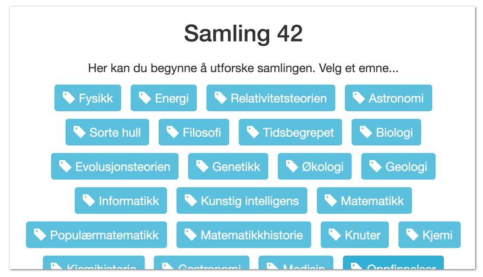
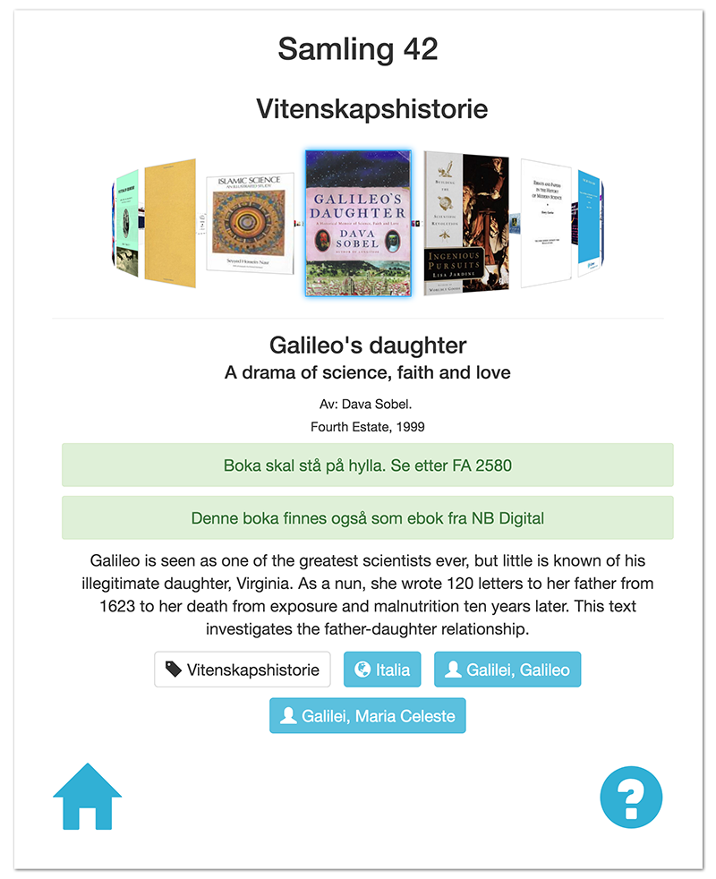

# colligator-frontend
Colligator (COLLection naviGATOR) is a system for displaying and navigating book collections.

# Install
npm install  
bower install

# Credits
The image handIcon is created by Open Exhibits and was found [here](https://www.flickr.com/photos/openexhibits/5885018620).
