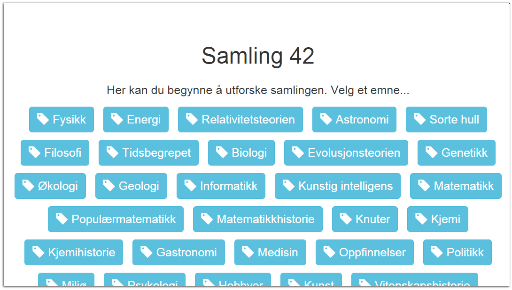

# colligator-frontend
Colligator (COLLection naviGATOR) is a system for displaying and navigating book collections. See also

- [A description of the system (in Norwegian)](http://www.ub.uio.no/om/prosjekter/scriptotek/colligator.html)
- [The backend](https://github.com/scriptotek/colligator-backend)
- [Vagrant box for development](https://github.com/scriptotek/colligator-vagrant)

# Install
npm install  
bower install

# Credits
The image handIcon is created by Open Exhibits and was found [here](https://www.flickr.com/photos/openexhibits/5885018620).
